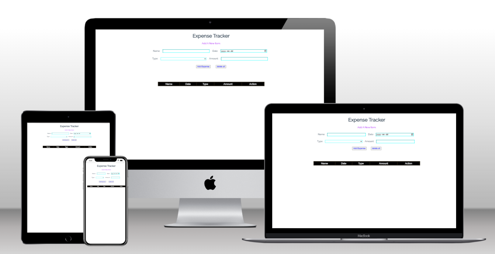
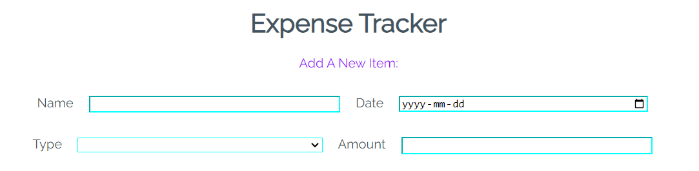
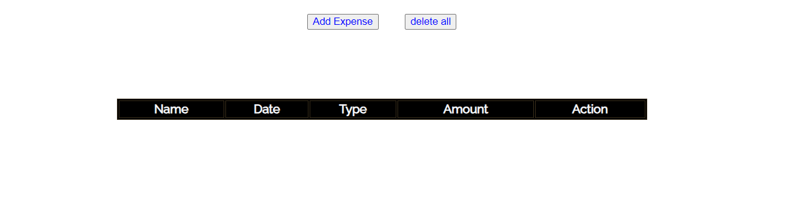
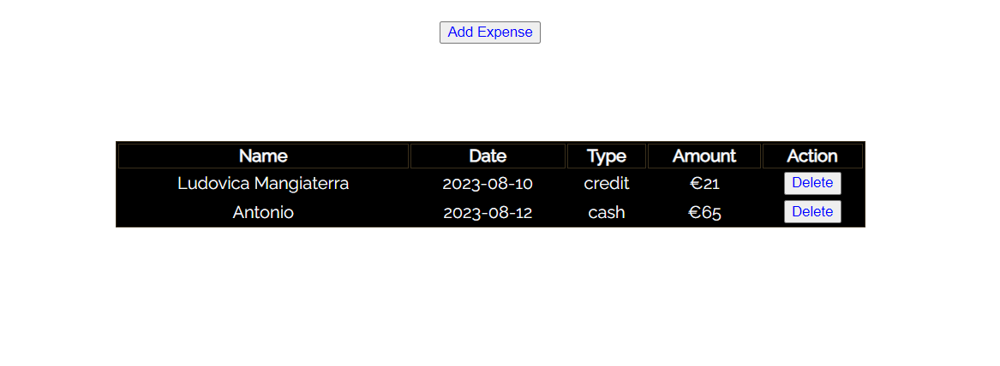
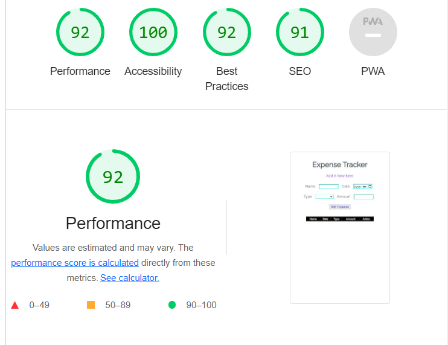

# portfolio Project 2

## Viewport image.

### The webpage restrain a page, constructed by HTML, CSS and JavaScript.

## First section of  webpage

It's assembled by two part;

1. it is a header, contain a title name that satisfies own goal "expense tracker"
2. It is a input option, specified for ectual user;
      1. Name.
      2. Date of expense.
      3. Type. there are two options; Cash or Credit-card.
      4. Amount spended.
   
   

## Second section of  webpage

It's assembled by three part;

1. Contain "Add Expense" button to add records of expenses in the table.
2. "Delete all" button to delete all rows.
3. The table, contain;
       1. Name.
       2. Date.
       3. Type.
       4. Amount.
       5. Delete button. It is for delete a row data, needs permission before action.
   

# Validator Testing

1. HTML
   No errors were returned when passing through the official W3C validator.

2. CSS
   No errors were found when passing through the official (Jigsaw) validator.

3. Accessibility

# deployment

The live link can be found here -

# Credits

Debugging can be divided in three part;

1. Conclusion to onclick function.
2. Conclusion of localStorage, helped by mentor.
3. Conclusion of delete all rows,

Checked by Tutor.

# content

The Idea has taken from a video: 

https://youtu.be/RYE0QQKJI9o

# Media

Coding idea taken from:

https://stackoverflow.com/questions/13049268/populate-table-using-submited-form-javascript

LocalStorage idea taken from:

https://www.w3schools.com/jsref/met_storage_setitem.asp
